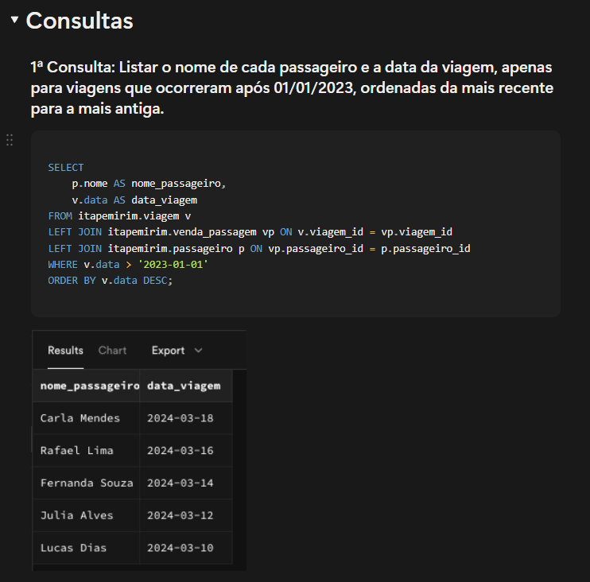
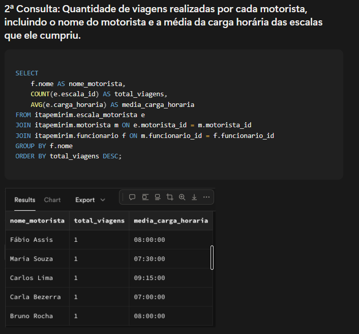
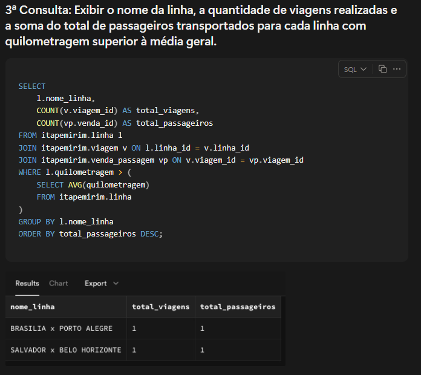
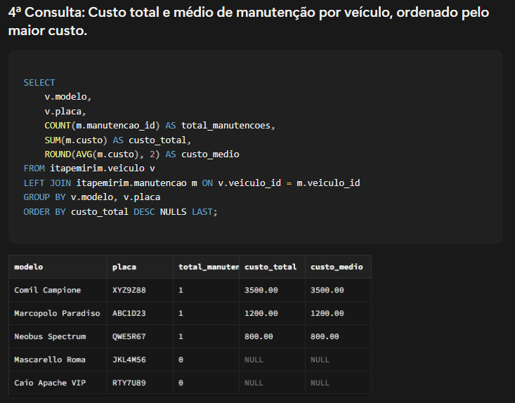
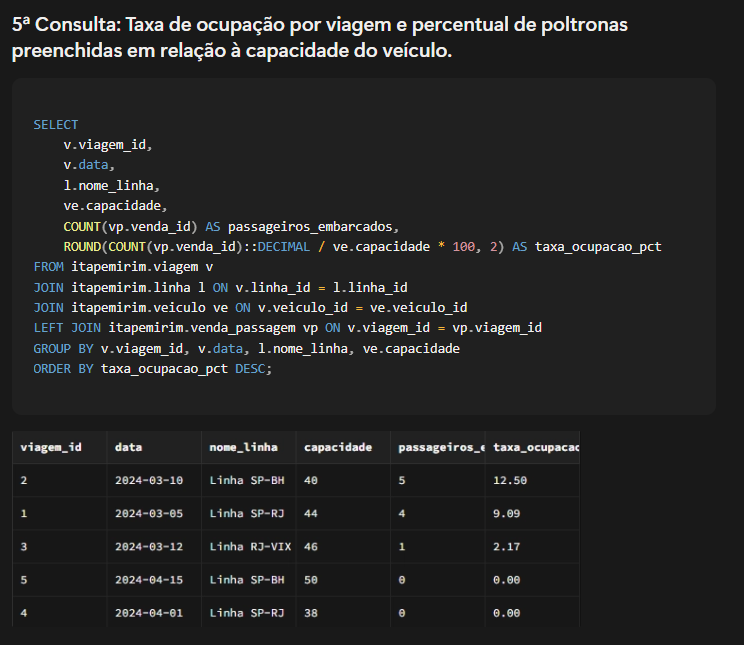
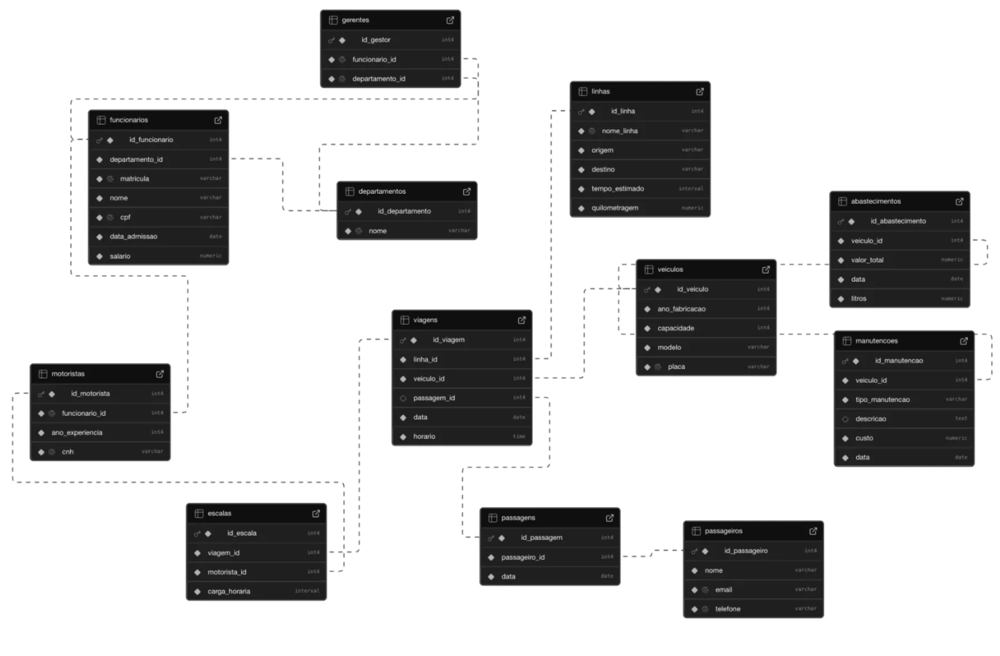

# itapemirim-db

Relational database modeling for a real bus transport company — ER diagram, PostgreSQL schema, data insertion and analytical SQL queries.

---

## About the Project

This project was developed as part of the **Database** course at FEI University, modeling a real operational scenario from **Itapemirim**, one of Brazil's largest intercity bus companies.

The system covers the full lifecycle of a transport operation: fleet management, routes, drivers, schedules, passengers, ticket sales, fueling, and vehicle maintenance.

The database was implemented and tested on **PostgreSQL via Supabase**.

---

## Repository Structure

```
itapemirim-db/
├── README.md
├── diagrams/
│   ├── er_diagram.png           # Entity-Relationship diagram
│   └── relational_diagram.png   # Relational model diagram
├── sql/
│   ├── 01_criar_tabelas.sql     # Schema and table creation with column descriptions
│   ├── 02_inserir_dados.sql     # Fictional data based on real operations
│   └── 03_consultas.sql         # Analytical SQL queries
└── docs/
    └── regras_transformacao.md  # ER-to-Relational transformation rules
```

---

## Data Model

### Entities

| Table | Description |
|-------|-------------|
| `departamento` | Company departments |
| `funcionario` | All employees (superentity) |
| `motorista` | Driver specialization (inherits from funcionario) |
| `veiculo` | Bus fleet |
| `linha` | Routes operated by the company |
| `viagem` | Scheduled trips |
| `passageiro` | Registered customers |
| `venda_passagem` | Ticket sales — associative table (N:M) |
| `escala_motorista` | Driver work schedules |
| `abastecimento` | Fueling records |
| `manutencao` | Vehicle maintenance records |

### Key Relationships

- `departamento` → `funcionario` — 1:N (one department, many employees)
- `funcionario` → `motorista` — 1:1 specialization (inheritance)
- `passageiro` ↔ `viagem` via `venda_passagem` — N:M (associative table)
- `veiculo` → `viagem` — 1:N (one vehicle, many trips)
- `motorista` → `escala_motorista` — 1:N (one driver, many schedules)

---

## Analytical Queries

| # | Query | Business Goal |
|---|-------|---------------|
| 1 | Trips by month | Understand operational frequency and peak hours |
| 2 | Average fare by route | Pricing and profitability analysis per route |
| 3 | Top passengers by purchases | Identify frequent customers for loyalty campaigns |
| 4 | Maintenance cost per vehicle | Plan fleet replacement based on operational cost |
| 5 | Occupancy rate per trip | Dynamic pricing and capacity optimization |

---
## Query Results

**Query 1 — Passengers and trip dates after 01/01/2023**


**Query 2 — Trips per driver and average workload**


**Query 3 — Routes with above-average distance**


**Query 4 — Maintenance cost per vehicle**


**Query 5 — Occupancy rate per trip**



## Relational Diagram

> Diagram auto-generated by Supabase from the original database instance.



## Technologies

- **PostgreSQL** — relational database
- **Supabase** — cloud database hosting
- **SQL** — DDL, DML and analytical queries

---

## ER-to-Relational Transformation

Three transformation rules were applied and documented:

1. **1:N Relationship** — `departamento` → `funcionario` (FK on the N side)
2. **Specialization/Generalization** — `funcionario` → `motorista` (1:1 inheritance)
3. **N:M Relationship** — `passageiro` ↔ `viagem` via associative table `venda_passagem`

Full documentation in [`docs/regras_transformacao.md`](docs/regras_transformacao.md)

---

##  Authors

Developed by **Kaique Pinheiro** and **Vinícius Purcinel**
FEI University — Computer Science & AI — 2025
